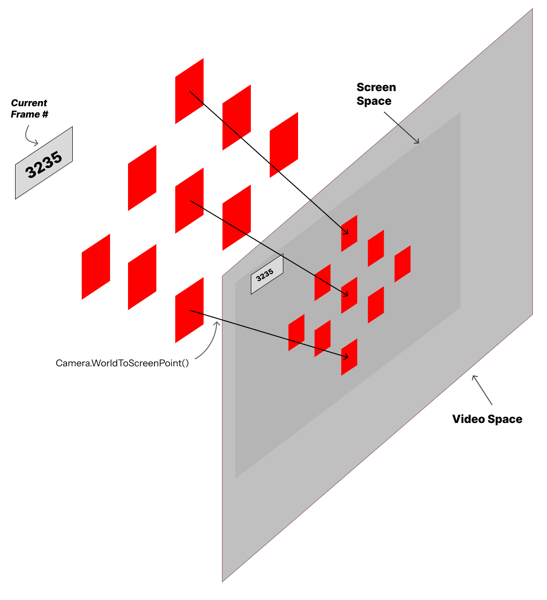
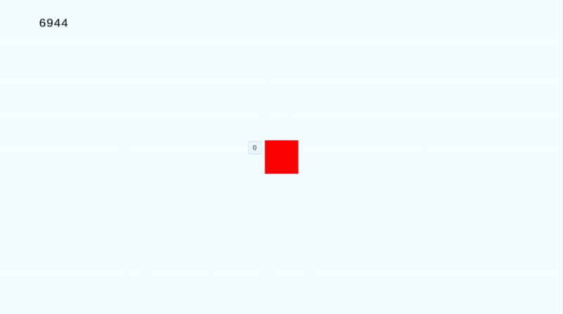
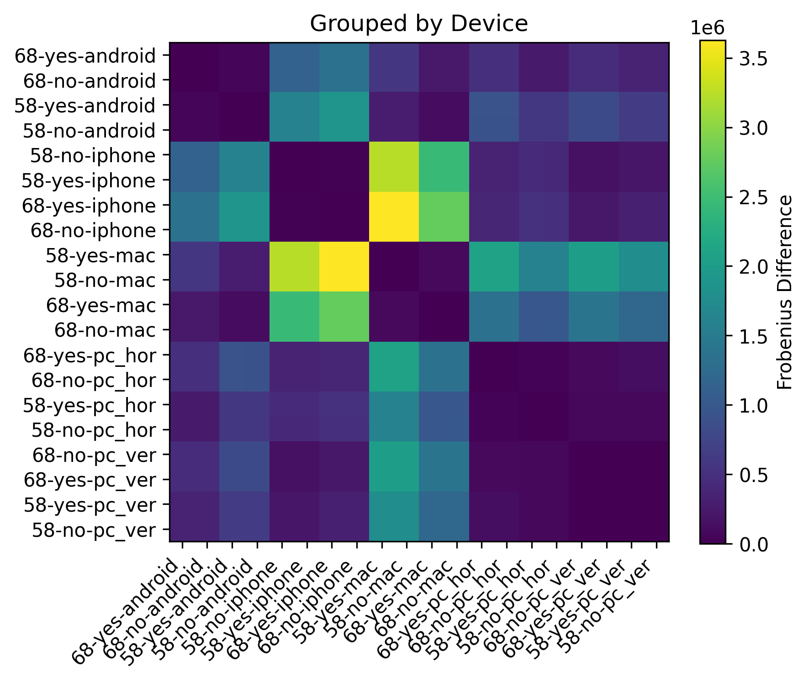

# Unity - ScreenSpace to VideoSpace Map

## Quick Facts

### Unity Build Specifics

- **Unity Version**: `2022.3.46f1`
- **Dependencies**:
    - [UnityUtils - V1.3.1](https://github.com/SimpleDevs-Tools/UnityUtils) - see the **Version 1.3.1 release**.
    - [Meta SKD](https://assetstore.unity.com/packages/tools/integration/meta-xr-all-in-one-sdk-269657) - Optimal way to run Unity builds on Meta Quest devices.

### Goals:

- To better understand how screen recordings differ between recording conditions (e.g. recording device, the IPD of the headset, and the presence of dynamic resolution.)
- To identify the optimal way to transform Unity-based positional data to video screen space coordinates.

### Findings:

- Meta devices cannot simultaneously **screencast** and **record video**. 
    - To initialize recording, you must record from the device viewing the screencast.
    - Mobile devices (iPhones, Androids) are optimal for recording, as the _Meta Horizon App_ ([iOS](https://apps.apple.com/us/app/meta-horizon/id1366478176), [Android](https://play.google.com/store/apps/details?id=com.oculus.twilight&hl=en_US)) comes with in-house recording functions in the app itself.
    - Meta's screen-casting function casts the screen from the **left eye**.
- A mapping operation from VR screen space to video space is possible, but has caveats.
    - Recordings do not differ based on the **dynamic resolution** setting in Unity. 
    - Adjusting the **IPD** produces slightly different recorddings, but the same mapping function is technically interchangeable if in a pinch.
    - **Device type** (e.g. Mac, Windows, iPhone, Android) are the most distinct causes of differences between recordings. Mapping operations MUST be re-calculated depending on recording device type.
    - Video recordings **do not necessarily align with frames from VR**. A different methodology is needed to connect video frames with Unity frames.

### Deliverables

Three major deliverables provided in this repository:

- `Unity/` : The Unity Project used for development and testing.
- `SVM.apk` : A built version of the Unity project, which can be sideloaded into your Meta device (Meta Quest 2, Pro, and 3).
- `Processing/` : The Python scripts used for post-processing.

## Methodology

### Feature Dimensions

We tested the following dimensions on a [Meta Quest 2](https://www.meta.com/quest/products/quest-2/), which features only three IPD levels but was one of the most popular devices at a price point of $300 during the COVID-19 pandemic. This test could, in theory, be replicated on a Meta Quest Pro or 3 but it is implicitly understood that the VR head-mounted display (HMD) will be an obvious factor in this. For our researcher's sanity, we isolated this experiment to just the Meta Quest 2.

We were primarily interested in which of these affect what is shown on screencast:

- **IPD** (58 vs 68)
- **Screen Cast Device & Applications**
    - Android w/ Meta Horizon App
    - iPhone w/ Meta Horizon App
    - Mac w/ QuickTime Player
    - PC w/ Horizontal Monitor & OBS
    - PC w/ Vertical Monitor & OBS
- **Dynamic Resolution in Unity (Off, On)**

#### Hardware Specs:

|Display Device|Resolution|Recording Methodology|
|:-|:-|:-|
|PC w/ Horizontal Monitor|`2560px` x `1080px`|Web Casting ([www.oculus.com/casting](www.oculus.com/casting)) + OBS|
|PC w/ Vertical Monitor|`1080px` x `1920px`|Web Casting ([www.oculus.com/casting](www.oculus.com/casting)) + OBS|
|Mac M1 Pro|`1512px` x `982px`|Web Casting ([www.oculus.com/casting](www.oculus.com/casting)) + QuickTime Player|
|iPhone XR|`1792px` x `828px`|[Meta Horizon App](https://apps.apple.com/us/app/meta-horizon/id1366478176), comes with a built-in recording feature|
|Motorola Razr Plus 2024|`2640px` x `1080px`|[Meta Horizon App](https://play.google.com/store/apps/details?id=com.oculus.twilight&hl=en_US), comes with a built-in recording feature|

### Data Collection: `Unity/`

<figure style="max-width:400px;margin-left:auto;margin-right:auto">

<figcaption>Example of a data calibration session where points in World Space are projected onto the Screen Space (i.e. the Camera Space). An additional projection is required for projecting those screen points onto the Video Space (i.e. the video recording).</figcaption>
</figure>

A 9-point calibration scheme was engineered in Unity. The Unity instance was a bare minimum environment with no landmarks, backgrounds, or other visual features. The 9-point calibration scheme was attached to the user’s head in the virtual world, always staying in front of and moving relative to the head. A frame counter was added in the periphery of this interface as a means of tracking in the video recording what Unity frame was currently being seen in the video; this would be important for data alignment in post-processing.

Data collection is divided into two major parts. In the VR simulation itself, a World-To-Screen projection calculation was performed for each calibration target in order to get each target’s position relative to Screen Space. This screen space represents the virtual camera frustrum of an individual “eye”; this in turn means that we were able to record the positions of each calibration target relative to the virtual camera of the user. All these coordinates are 3-dimensional vectors where the X and Y coordinates are relative to the bottom-left corner of the camera frustrum while the Z-position is the distance of that point to the screen.

The second part of the data collection features a simple video recording of this calibration simulation, across different hardware and software conditions. We took advantage of Meta’s in-built screen-casting feature to accomplish this, which visualizes what the VR user is seeing from the perspective of the left eye. This video recording is not inherently in alignment with the screen space of the virtual cameras in Unity, thus requiring an unknown projection matrix to convert from screen to video space. Nonetheless, each video recording captures the calibration target as well as the frame counter in the top-left. In post-process analysis, template matching was used to identify the positions of each calibration target relative to the video frame; these positions would be relative to the top-left pixel of the video capture.

<figure style="max-width:400px;margin-left:auto;margin-right:auto">

<figcaption>Run-through of the calibration step, with calibration targets appearing and disappearing one at a time.</figcaption>
</figure>

The steps for data collection are as follows:

1. When opening the calibration stage, the screen-cast to either "Mobile" (for Android and iPhone) or "Web" (for PC or Mac). The video recording is started promptly.
2. The calibrabration stage starts. The video continues to record until the calibration phase ends.
3. The outputted `.csv` and `.mp4`/`.mov` are aggregated for post-analysis.
4. Steps 1-3 are replicated across multiple IPD settings, Dynamic Rendering toggling, and recording devices.

### Post-Process Analysis: `Processing/`

Calibration is run by the `Processing/calibrate.py` script. The major steps involved are:

1. **Frame Number Extraction**: Identify key frames from the video associated with each isolated calibration target. This involves:
    1. frame-cropping to extract the specific region of interest in the video where the frame counter is visible.
    2. Grayscale-ing and Binary Thresholding each region of interest
    3. Applying Optical Character Recognition (OCR) to read the frame count from the thresholded region of interest.
2. **Template Matching**: Mapping the frame with the appearance of each calibration target, extracting at least one frame per target. This involves:
    1. Upon successful frame number extraction, we compare each frame to the VR frame timestamps of each calibration target.
    2. Once a calibration target is mapped to a frame, the calibration target - frame pair is cached.
    3. For each target - frame pair, **template matching** is used to identify the centroid coordinates of each calibration target as they appear in the video. The screen space coordinates and estimated video space coordinates of each calibration target are cached for later.
3. **Least-Squares Solution to Linear Matrix Mapping**: Across all screen - video coordinate pairs of the calibration session, the transformation matrix to calculate the projection mapping from screen space to video space is conducted using least-squares (see [np.linalg.lstsq](https://numpy.org/doc/stable/reference/generated/numpy.linalg.lstsq.html)).
4. **Validation**: Once the transformation matrix is estimated, a validation step is conducted where each calibration target's video space coordinates are estimated using the transformatio matrix.

<figure style="max-width:400px;margin-left:auto;margin-right:auto">

<figcaption>Example of an extracted frame associated with the 4th calibration target. The light-blue diamond marker is the position of the calibration target in the video, derived from template matching. The light-blue orthogonal cross in the white void is the raw screen space coordinates of the actual calibration target recorded from VR. Finally, the black cross represents the estimated position of the calibration target, transformed from screen space to video space. The fact that the black cross overlaps the light-blue diamond means that the transformation matrix correctly projects screen-space coordinates.</figcaption>
</figure>

### Further Estimations

The `Unity/` build provided with this repository has another scene that is used for further estimation and validation of the derived transformation matrix. To accomplish this, simply start and stop a video recording once the "Cube" scene is additively loaded into the "Base" scene - this can be toggled by pressing the "A" button on Meta Quest controllers. The scene is auto-set to record the position of a floating cube in front of the VR user, so nothing else needs to be toggled by the VR user.

<figure style="max-width:400px;margin-left:auto;margin-right:auto">

<figcaption>A scene with a blue cube and dark background is provided for debugging and further validation of the derived transformation matrix from calibration.</figcaption>
</figure>

The `Processing/estimate.py` handles all operations with estimating the positions of GameObjects in a video. The general steps that this script conducts are:

1. **Frame Number Extraction**: Similar to the same step in Post-Processing Analysis, a series of ROI extraction, grayscaling, thresholding, and OCR-ing are done to extract the VR frame number from each video frame.
2. **Frame - GameObject Mapping**: For each frame, identify any GameObjects that were visible in that frame. This is done by cross-referencing the extracted frame number from a `.csv` file outputted by the VR simulation - in this case, the blue cube's position data in screen space.
3. **Projection via Transformation Matrix**: Apply projections for each frame's blue cube into video space.
4. Re-render the video with the re-calculated video space coordinates of each GameObject, for visual inspection.

The outcome of one such operation is shown below, which demonstrates a successful transformation of screen to video space coordinates.

<figure style="max-width:400px;margin-left:auto;margin-right:auto">

<figcaption>A scene with a blue cube and its screen space position, recalculated to video space through a transformation matrix projection calculated earlier.</figcaption>
</figure>

## Results

### Analysis Methodology

We derived that the simplest way to derive the differences across the various conditions is to measure the differences in the estimated transformation matrices in of themselves. In an ideal situation where two conditions are identical, their transformation matrices should be similar, if not identical. Thus, measuring differences in their transformation matrices is suitable. We quantify that difference through two methods: 1) pair-wise Frobenius Distance of transformation matrices between each possible pair of conditions, and 2) the Squared Frobenius Distance of transformation matrices across each possible pair of conditions.

Let $\{A_1, A_2, \ldots, A_n\}$ be the set of transformation matrices, where each $A_i \in \mathbb{R}^{m \times k}.$  We define the Frobenius Distance matrix $D \in \mathbb{R}^{n \times n}$ as:

$$
D_{ij} = \| A_i - A_j \|_F = \sqrt{\sum_{p=1}^{m} \sum_{q=1}^{k} (A_{i,pq} - A_{j,pq})^2 }
$$

Alternatively, we define the Squared Frobenius Distance matrix as:

$$
D_{ij} = \| A_i - A_j \|_F^2 = \sum_{p=1}^{m} \sum_{q=1}^{k} (A_{i,pq} - A_{j,pq})^2
$$

There are, naturally, some issues with this approach. Firstly, we need to contend with the reality that any operations that involve float-point precision such as `numpy.linalg.lstsq` may suffer very miniscule imprecisions that coalesce over time. Furthermore, there may always be the potential of ill-ranked matrices, null values, etc. We are fortunate that we need a relatively simple solution given that we are only measuring 2D coordinates. Finally, we recognize that the Frobenius Distance operation simplifies the comparison down to 1D values as opposed to a fuller analysis with 2D semantic structures. Nonetheless, we still believe there is value in utilizing the Frobenius Distance and Squared Frobenius Distance as rough measurements of differences between transformation matrices.

### Distance Heatmaps (clustered across features)

To best represent the pair-wise analysis, we've generated three diferent heatmaps depicting the differences. Darker colors correlate to smaller differences, while lighter colors represent greater differences. The naming structure of each column and row defines `<IPD>-<DYN. RES>-<DEVICE>`.

In summary, we can argue the following:

- Changing between dynamic resolution does NOT affect recording, so no need for a new transformation matrix
- Changing the IPD produces a minor change in transformation matrix, so a re-calculation is needed. However, in a punch, it may be okay to use the same transforamtion matrix.
- Switching recording devices DOES require a different transformation matrix

## Conclusion

It is relatively safe to utilize Dynamic Resolution in Unity. However, changes in IPD and device recording methodology entail different calibrations. Due to the inherent variability in users' IPDs, it might be ideal to pre-compute the IPD of each possible IPD value across different headsets and utilize them when necessary. In a pinch one may be able to use a different calibration setting if the IDPs are relatively similar to one another, but it is not the ideal situation.

We generally recommend that you calibrate based on left screen positioning, for both the calibration and for estimation.